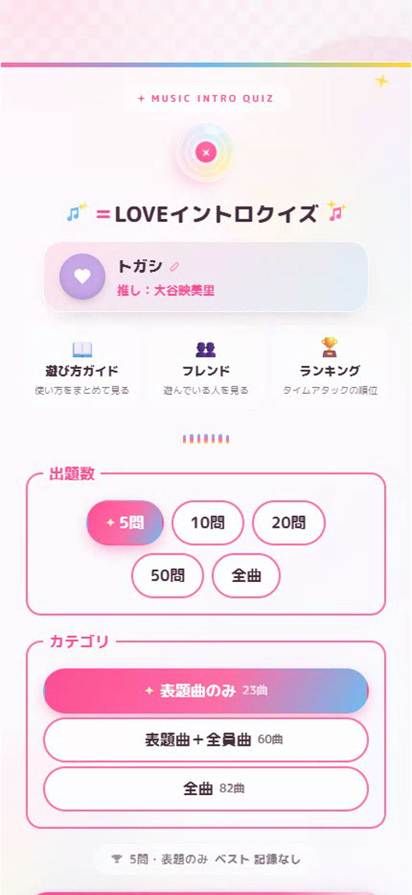
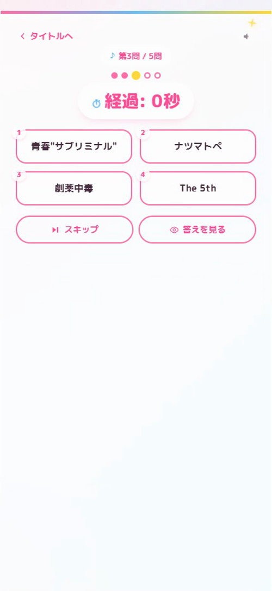
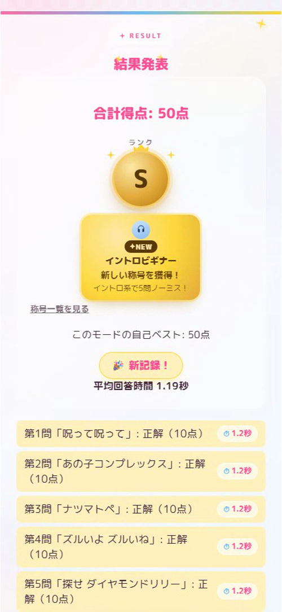
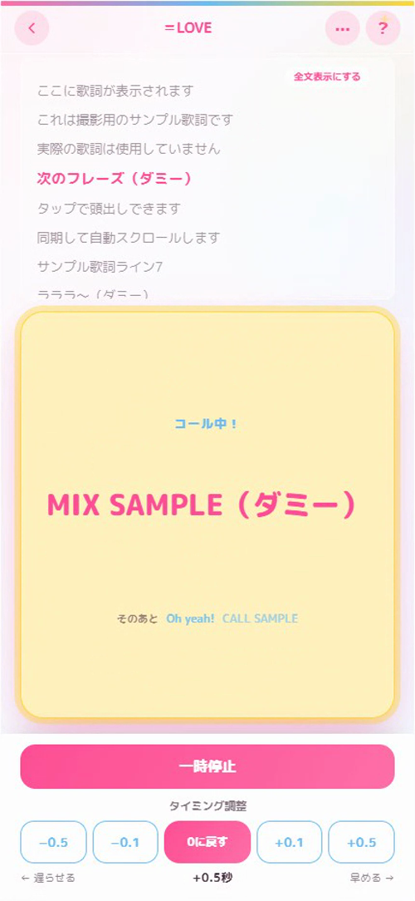

# ＝LOVEイントロクイズ（＝LOVE Intro Quiz）

アイドルグループ **＝LOVE（イコールラブ）** の楽曲で遊ぶ、ブラウザ／スマホ（PWA）向けの音楽クイズゲームです。イントロを聴いて曲名を当てるクイズを中心に、タイムアタック・オンライン対戦・ライブコール練習など、**「ファンが繰り返し遊べる」体験**を目指して個人開発しました。フレームワークを使わない素の HTML / CSS / JavaScript で実装しています。

> ⚠️ **非公式のファン制作物です。** ＝LOVE および権利者・関係各社とは一切関係ありません。実在する楽曲音源・歌詞・公式画像は、このリポジトリには含めていません（詳細は[音源について](#音源について)）。

> 📌 就職活動のポートフォリオとして公開しています。企画意図・工夫・役割分担をまとめた資料とプレイ動画は、別途応募資料として提出しています。

## スクリーンショット

| ホーム | イントロクイズ | 結果（ランク／自己ベスト） | ライブコール |
|:---:|:---:|:---:|:---:|
|  |  |  |  |

## 制作動機

＝LOVE のファンで、「曲をもっと覚えたい・記録で競いたい・ライブをもっと楽しみたい」という **自分自身の欲求** が出発点でした。既存の一般的なイントロクイズには「特定のグループの曲を、深く・多彩に遊ぶ」体験がなかったため、当事者として企画から作りました。

## 主な機能

### 遊ぶ
- **イントロクイズ**：イントロを聴いて曲名を 4 択。回答の速さに応じた段階式スコアリングでランク（S/A/B/C）・自己ベストを判定。
- **タイムアタック ＋ 統合ランキング**：全問正解までのタイムを競い、通常クイズも参加できる統合ランキングへ反映。
- **オンライン対戦**：ルーム作成 → 参加 → 3・2・1 → 同じ問題をリアルタイム対戦（Firebase・時刻同期）。
- **ライブコール**：曲に同期して「次のコール」を表示。ライブ前の練習にも使える。
- ほかに、ランダム再生クイズ／歌詞クイズ／オリジナル問題作成／苦手曲モード／ローカル対戦。

### 記録・育成
- プレイ履歴（全モード横断）・自己ベスト・平均回答時間
- 統合ランキング（ルール・出題数・カテゴリ別）
- 称号 17 種／苦手曲の自動収集（4 モード合算）

### 音楽・ファン
- 収録 81 曲の一覧・検索・試聴／お気に入り／プレイリスト／オフライン連続再生
- 推し設定／フレンド（公開プロフィール）／メンバー・作品・年表・ライブ（公演一覧）

（全機能は、起動後にアプリ内で確認できます。）

## 特徴的な実装（工夫）

1. **カラオケ同期の状態設計バグを根治** — 一時停止 → 再開でコールがズレる問題を、再生時間と補正値を別々の状態に分離して根本解決。
2. **苦手曲モードを 4 モード横断で作り直し** — 途中でやめた回答も 1 問ごとに集計し、3 回答以上かつ正答率 50% 未満を自動で苦手曲に。間違える → 集まる → 復習が成立する設計に。
3. **統合ランキングへ再設計** — タイムアタック専用だったランキングを、通常クイズも参加できる形へ。既存データを壊さないよう配慮して移行。
4. **ライブコール** — ライブで初参加者がコールのタイミングに戸惑う課題を、曲に同期したコール表示で解決（ユーザー課題を機能に落とし込んだ例）。

## 技術構成

- HTML / CSS / JavaScript（フレームワーク・ライブラリ不使用、ES Modules で分割）
- PWA：`manifest.json` + Service Worker（`sw.js`）でオフライン起動・ホーム画面インストールに対応
- Firebase Realtime Database ＋ 匿名認証（オンライン対戦・統合ランキング・フレンド公開プロフィール）
- IndexedDB（音源／歌詞／コールを端末内に保存＝配布しない権利配慮）、localStorage（履歴・苦手曲統計・お気に入り等）
- Web Audio API（イントロ再生・効果音）

### 簡単なアーキテクチャ

```
端末（ブラウザ / PWA）── 単体でも遊べる
  ├ Web Audio API  … イントロ再生・効果音
  ├ localStorage   … 履歴・苦手曲・お気に入り・設定
  ├ IndexedDB      … 音源・歌詞・コール（端末内に保存）
  └ Service Worker … オフライン起動・インストール
        │  匿名認証で接続（オンライン時のみ同期）
        ▼
Firebase Realtime Database（クラウド）
  └ オンライン対戦・統合ランキング・フレンド公開プロフィール
```

## 自分の役割 / AI の利用範囲

- **私（制作者）**：企画・コンセプト、ゲームモード／ルールの仕様判断、UI/UX、スマホ実機での検証、不具合・使いにくさの発見、改善方針の決定・完成判断。
- **AI（Claude Code）**：調査、実装支援・コード生成、テスト支援、自動化の補助。

「AI に丸投げ」でも「全部を独力で実装」でもなく、**プロダクトオーナーとして判断・検証を自分が担い、AI を実装支援ツールとして活用**しながら反復開発しました（約 1 か月・173 commits）。

## テスト

- 自作のテスト **51 ファイル・1,511 アサーション**。オンライン同期・苦手曲判定・ランキングなど、主要ロジックを検証しながら開発しました。

## ローカルでの起動方法

ES Modules を使用しているため、`index.html` をダブルクリックして直接開いても動作しません（ブラウザのセキュリティ制限のため）。簡易的なローカルサーバー経由で開いてください。

- **VSCode の「Live Server」拡張機能**：このフォルダを開き、`index.html` を右クリック →「Open with Live Server」を選択。

## デモ・動画

- 🎮 著作権クリーンな “触れるデモ”（別プロジェクト Intro Dash）：<https://togashi-sota.github.io/intro-dash>
- ▶ プレイ動画（約 75 秒）：応募資料に別添。

## 音源について

本アプリは「実在する＝LOVE の楽曲イントロを当てる」ことを目的にしていますが、著作権の関係上、本物の楽曲音源はこのリポジトリには含めていません。

- 曲データ（`js/data/songs.js`）に曲名・選択肢などの情報を管理しますが、対応するイントロ音源そのものはコードに含まれません。
- 音源は、利用者が自分の端末で選んだ mp3 ファイルを、ブラウザの IndexedDB（端末内の保存領域）に読み込む方式です。読み込んだ音源は各端末のブラウザ内に留まり、サーバーや GitHub には一切送信・保存されません。
- `assets/audio/local/` は開発時に音源を一時的に置く場所で、`.gitignore` で除外され GitHub にはアップロードされません。

## ライセンス

このリポジトリのコード（HTML / CSS / JavaScript）は [MIT ライセンス](LICENSE) のもとで管理しています。ただしこれはコードのみに適用されるものであり、＝LOVE の楽曲・音源の著作権とは無関係です。
