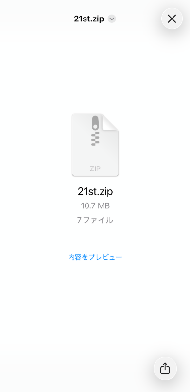
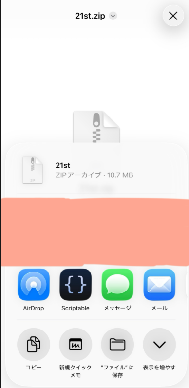
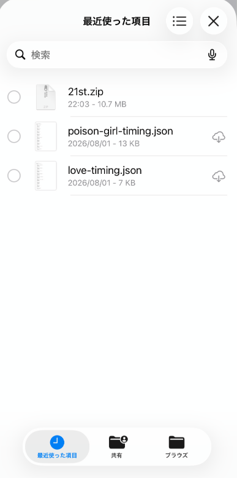
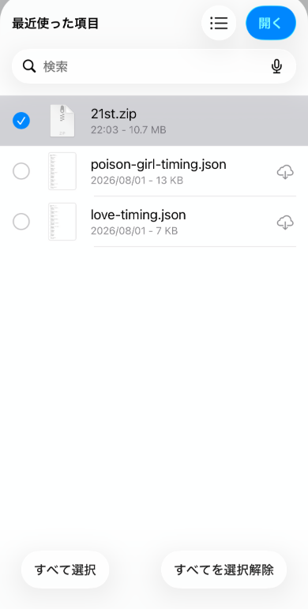

# データパックの入れ方

音源・歌詞などの「データパック」を、ほかの人から受け取ってこのアプリへ取り込む手順の説明です。

アプリ内にも同じ内容の画像付きガイド（`guide-data-pack.html`、データ管理画面から「📖 データパックの入れ方」で開けます）があります。このファイルはGitHub上での閲覧・外部共有用の同内容版です。

> **著作権について**：このファイル・アプリ本体には実際の音源・歌詞本文などの著作権保護コンテンツは一切含まれていません。データパック（`full.zip`・`21st.zip`等）は個別に受け渡しするものであり、GitHub・GitHub Pages上には一切公開していません。

## まず知っておいてほしいこと

- 受け取ったZIPを**自分で解凍する必要はありません**（アプリが自動でやります）
- 中のmp3やJSONファイルを**1個ずつ選ぶ必要もありません**
- **ZIPファイル1個だけ**選べば、あとはアプリが処理してくれます
- ただし、**ZIPを受け取っただけでは終わりではありません**。一度「端末に保存」してから、アプリで選ぶ、という2段階の操作になります

## あなたはどちらですか？

### 🆕 はじめてこのアプリを使う方

「全曲パック」（`full.zip`）を受け取ってください。これまでの曲をすべて含んだパックなので、これ1つで全部遊べるようになります。

### 🔄 すでに使っている方（新しいシングルだけ追加したい）

「追加パック」（自分がまだ入れていないシングルの分。例：`21st.zip`・`22nd.zip`など）を受け取ってください。今まで入れたデータはそのまま残り、新しいシングルの分だけが追加されます。しばらく間が空いていて複数回分が未導入の場合は、それぞれの追加パックを1つずつ順番に読み込んでください（`full.zip`を入れ直す必要はありません）。

## 📱 iPhoneでの手順（実際の画面つき）

🆕 はじめての方は`full.zip`（これまでの全曲）を、🔄 すでに使っている方はまだ入れていない回の追加パック（例：`21st.zip`）を使ってください。どちらのZIPでも、受け取ったあとの操作は同じです。

**STEP 1：LINEでZIPを開く**

LINEで送られてきたZIP（`full.zip`・`21st.zip`・将来の`22nd.zip`など）をタップして開くと、この画面になります。「内容をプレビュー」は押さず、**右下の共有ボタン**をタップします。

**STEP 2：ZIPを「ファイル」に保存**

共有画面が開いたら「**“ファイル”に保存**」をタップし、保存先（あとで見つけやすい「このiPhone内」がおすすめ）を選んで保存します。

> **⚠️重要：ZIPは解凍（展開）せず、そのまま保存してください。**

**STEP 3〜4：＝LOVEクイズで「データ管理」→「追加データパックを読み込む」**

保存できたら＝LOVEクイズに戻り、ホーム画面を一番下までスクロールして「データ管理（音源・歌詞の読み込み）」を開き、「追加データパックを読み込む」をタップします。ここでOS標準のファイル選択画面が開きます。

**STEP 5：保存したZIPを選ぶ**

保存した直後は「最近使った項目」に、さっき保存したZIP（例：`21st.zip`）が表示されていることが多いです。表示されていれば、それをタップします。**見つからない場合は**、下にある「ブラウズ」から自分がZIPを保存した場所を開いて選んでください。

**STEP 6：ZIPを選択して「開く」**

目的のZIPを選ぶとチェックが付きます。そうしたら右上の「**開く**」をタップします。

**STEP 7：完了メッセージを確認**

アプリ側で自動的に展開・登録され（少し時間がかかることがあります）、完了メッセージ（例：「全曲パックでセットアップしました／音源◯曲・歌詞◯曲・コール◯曲を登録しました」）が表示されれば成功です。すぐにクイズ・歌詞・コール等が使えるようになります。

## 🤖 Android・PCの場合

アプリ側の操作（上のSTEP3〜7と同じ「データ管理」→「読み込むボタン」→「完了メッセージ」の流れ）はiPhoneと共通です。違うのは「ZIPの受け取り方・保存方法」と「ファイル選択画面の見た目」の2点だけです。

- Chromeでダウンロードしたり、メール・LINE等で受け取ったりしたZIPは、多くの場合「ダウンロード」フォルダに自動保存されます
- 機種によって標準のファイル管理アプリ名が異なります（「ファイル」「My Files」等）
- ここでも「解凍する」操作は不要です。**ZIPのまま保存してください**
- ファイル選択画面の見た目は機種によって異なりますが、ZIPを保存した場所（多くの場合「ダウンロード」）を開いて選択すれば、あとの操作はiPhoneと同じです

## 新規ユーザー向け：具体的な手順（全11ステップ）

1. アプリのURLを開く
2. 必要であれば「ホーム画面へ追加」しておく（毎回URLを開かなくて済むようになります）
3. `full.zip`（全曲パック）を受け取る
4. iPhone/Androidの端末へZIPを保存する
5. アプリを開く
6. ホーム画面を下までスクロールし「データ管理」を開く
7. 「追加データパックを読み込む」をタップする
8. 保存した`full.zip`を選ぶ
9. アプリ側で自動的に展開・登録される（少し時間がかかることがあります）
10. 完了メッセージが表示される
11. その後すぐにクイズ・歌詞・コール等が使える

## 既存ユーザー向け：具体的な手順（全7ステップ）

1. まだ入れていないシングルの追加パック（例：`21st.zip`）を受け取る
2. 端末へ保存する
3. アプリを開く
4. 「データ管理」を開く
5. 「追加データパックを読み込む」をタップする
6. 受け取った追加パックを選ぶ
7. そのシングルの分だけが追加され、これまでのデータはそのまま残る（未導入のシングルが複数ある場合は、1〜6を繰り返す）
